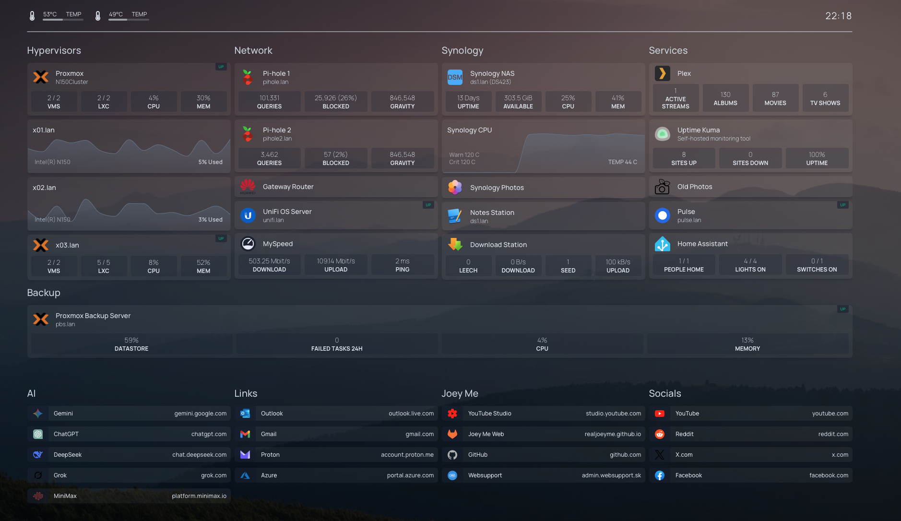
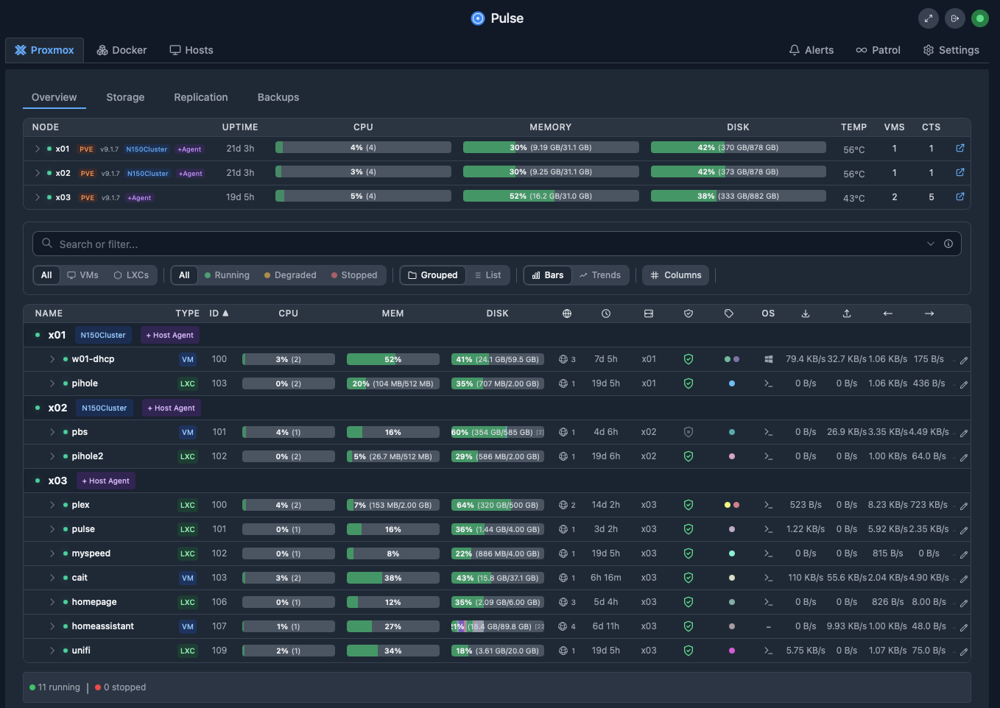
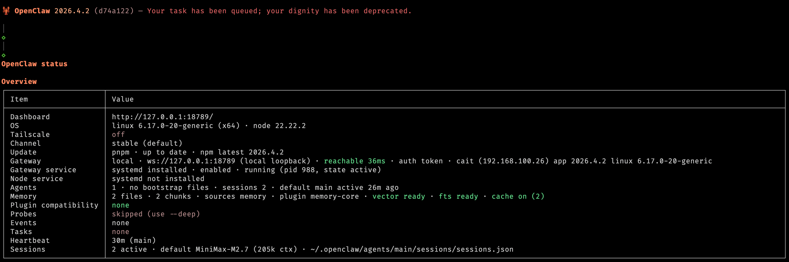
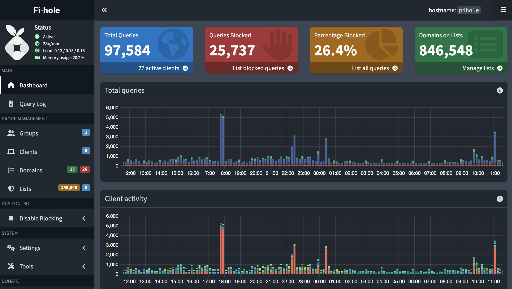
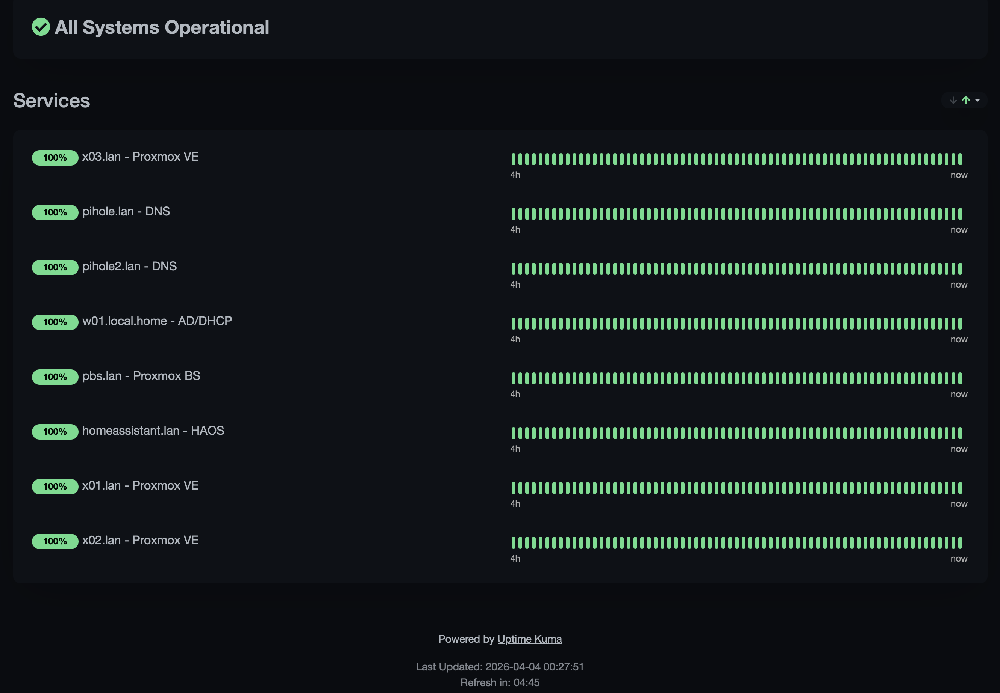
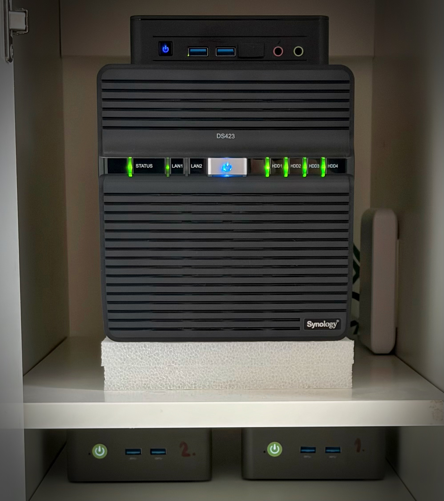
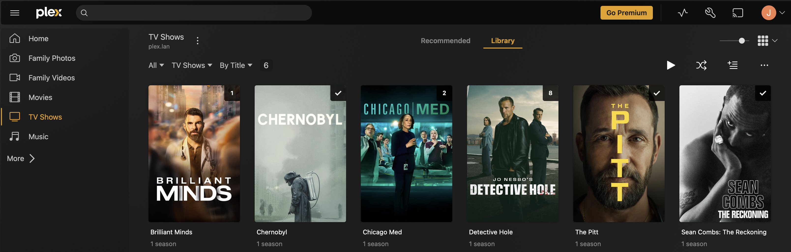
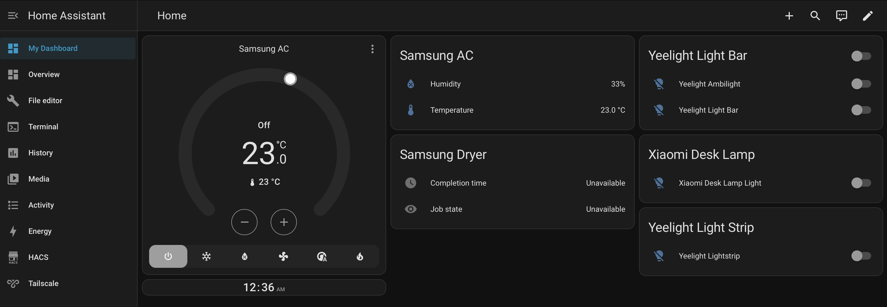

# Homelab — April 2026

> Snapshot of my self-hosted services running as of April 2026.

---

## ✨ Infrastructure

### ✅ Proxmox VE (N150Cluster)
High-availability Proxmox VE cluster running on two **GMKTEC NUCBOX G3 Plus** nodes, each equipped with an **Intel N150** processor, **32GB RAM**, and a **1TB NVMe SSD**. Zero-downtime resilience is achieved via ZFS-replication, syncing mission-critical VMs to the secondary node at 15-minute intervals.

A third standalone node — **x03.lan** — handles less critical workloads and serves as the cluster's **Corosync quorum Qdevice** (Intel NUC 11, N6005, 32GB RAM, 1TB NVMe SSD).

| Node | Role | Hardware | Status |
|------|------|----------|--------|
| x01.lan | Cluster member | N150 / 32GB / 1TB NVMe | Active |
| x02.lan | Cluster member | N150 / 32GB / 1TB NVMe | Active |
| x03.lan | Standalone + Qdevice | N6005 / 32GB / 1TB NVMe | Active |

**Cluster:** 2-node knet transport, secure authentication enabled
**Quorum:** Quorate with Qdevice — expected votes 3, quorum 2
**Proxmox VE version:** 9.1.7

### ✅ Windows Server 2022
On-premises identity and directory infrastructure running **Active Directory Domain Services**, providing user and computer authentication across the homelab. Also serves as the **DHCP server** for the LAN and runs the **MS DNS role** for internal name resolution. Running as a **highly available VM on the Proxmox VE cluster**, replicated to the secondary node in 15-minute intervals.

### ✅ Proxmox Backup Server (PBS)
Dedicated backup solution for the Proxmox cluster, handling incremental backups and snapshot management for all VMs and containers. Running as a **highly available VM** with a **600GB local NVMe datastore** — both the VM and datastore are replicated within the cluster. NVMe-backed storage ensures fast restore times.

**PBS version:** 4.1.5

### ✅ Homepage
Modern, fully static, fast, and highly customizable application dashboard. Configured via YAML files with widget integrations for all major services. CPU and temperature monitoring powered by **Glances**.

### ✅ Pulse
Single pane of glass monitoring for the entire Proxmox infrastructure — provides unified dashboard, Telegram alerts, temperature monitoring, SSD health/disk life, backup overview, and AI-powered insights. Replaces the need for multiple monitoring tools with one cohesive interface.

---

## 🤖 AI Agent

### ✅ Cait (OpenClaw)
Personal AI assistant running as an **OpenClaw** agent on a dedicated **Ubuntu Desktop VM**. Powered by **MiniMax-M2.7** as the primary LLM brain. Handles automation, homelab management, documentation, and general assistance — acting as the intelligent core of the entire setup.

---

## 🚀 Network

### ✅ Pi-hole (×2)
Two instances of network-wide ad blocker running on the LAN. Blocks ads and trackers at the DNS level with live query statistics and gravity blocklist management. Using **StevenBlack/hosts** blocklist with categories for ads, tracking, spam, gambling, and adult content. Additionally, most IoT devices have their cloud telemetry and "calling home" individually blocked at the DNS level — while preserving local control via Home Assistant. Result: **26% of all DNS queries blocked**.

Kept in sync via **Nebula-sync** Docker container running on the Synology.

**Pi-hole version:** v6.4

### ✅ UniFi OS Server
Management platform for Ubiquiti networking gear. Physical switch: **UniFi Flex Mini 2.5Gbit** — all devices in the homelab are connected at 2.5Gbit.

### ✅ MySpeed
Self-hosted internet speed test tracker that logs and displays historical download/upload speeds and ping metrics.

### ✅ Uptime Kuma
Self-hosted monitoring tool tracking the uptime and response time of internal and external services. Monitoring up to 8 services with reported 100% uptime.

---

## 💾 Storage

### ✅ Synology DS423+ (NAS)
DiskStation NAS running **DSM 7** on an ARM-based processor with a **4× 2.5" SSD configuration**:

| Storage Pool | Drives | Configuration | Use Case |
|-------------|--------|--------------|----------|
| Storage Pool 1 | 2× 1TB WD Red SA500 | RAID 1 (BTRFS) | Primary data store | 576.8 GiB available |
| Storage Pool 2 | 2× 500GB Samsung 860 EVO | RAID 0 (BTRFS) | Media, backups, ISO libraries, Time Machine target | 303.5 GiB available |

Both pools use **BTRFS** with periodic snapshots for data protection. A custom **Realtek NIC driver from bb-qq** enables a **2.5Gbit USB-NIC** based on the **RTL8156B** chip — providing full 2.5Gbit throughput sustained during extended file transfers.

- **Services:** Synology Photos, Notes Station, Download Station, Nebula-sync
- **Uptime:** Months of continuous operation with zero packet drops recorded
- **DSM version:** 7.3.2-860009 Update 3

---

## 🎬 Media

### ✅ Plex
Media server streaming personal video and music libraries to devices across the network. Running as a **Proxmox LXC container** — extremely lightweight at only **~200MB RAM** and negligible CPU usage. Originally evaluated Jellyfin, but stuck with Plex due to native Samsung Smart TV app and no transcoding requirements.

**Remote access:** **Tailscale** enables streaming PlexAmp on iOS from anywhere with better quality than traditional music streaming services — at zero cost.

- **Library:** 87 movies, 6 TV shows, 130 albums

---

## 🏠 Home Automation

### ✅ Home Assistant
Central hub for smart home integration. Manages lights, switches, and presence detection.

---

## 🔮 Future Plans

### Technitium DNS (replacing Pi-hole)
Pi-hole has been solid, but Technitium DNS does more — it handles both authoritative and recursive DNS with ad-blocking built in. No more Nebula-sync since Technitium has native clustering. The plan is to use my own public domain for **split-brain DNS** so internal services get internal IPs while public records resolve normally.

### Reverse Proxy with Let's Encrypt
Getting tired of self-signed certificate warnings. Planning to add a reverse proxy (Nginx Proxy Manager or Traefik) so everything gets proper **Let's Encrypt certificates**. Should make the whole setup a lot smoother to use.

---

*Last updated: April 2026*
