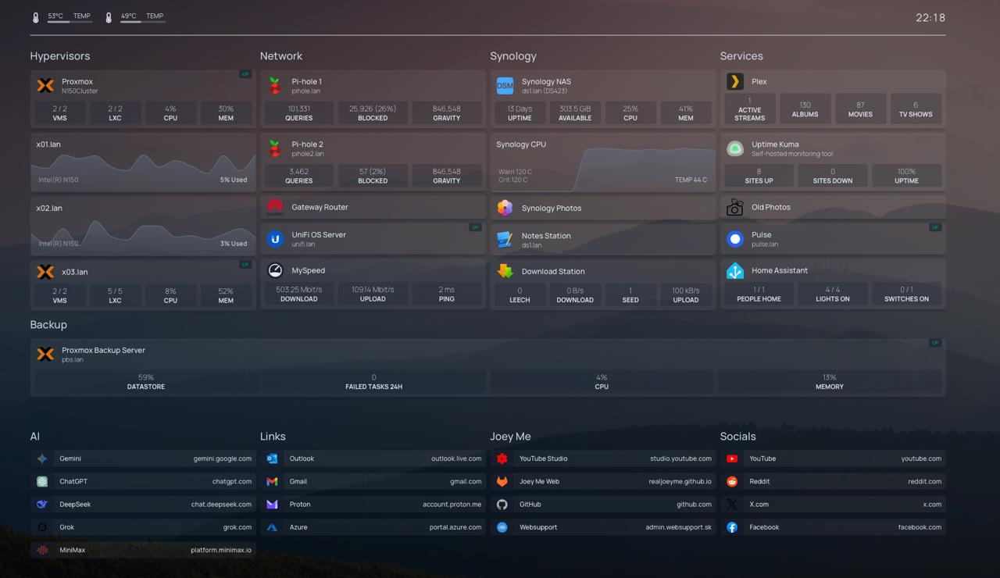

# Homelab — April 2026

> Snapshot of my self-hosted services running as of April 2026.

---

## Infrastructure

### Proxmox VE (N150Cluster)
Proxmox virtual environment cluster with three nodes (x01.lan, x02.lan, x03.lan) providing virtualization for VMs and LXC containers with real-time CPU/RAM monitoring.

### Proxmox Backup Server (PBS)
Dedicated backup solution for the Proxmox cluster, handling incremental backups and snapshot management for all VMs and containers.

---

## Network

### Pi-hole (×2)
Two instances of network-wide ad blocker running on the LAN. Blocks ads and trackers at the DNS level with live query statistics and gravity blocklist management.

### UniFi OS Server
Management platform for Ubiquiti networking gear — switches, access points, and security gateways.

### MySpeed
Self-hosted internet speed test tracker that logs and displays historical download/upload speeds and ping metrics.

### Uptime Kuma
Self-hosted monitoring tool tracking the uptime and response time of internal and external services — currently showing 8 sites up at 100% uptime.

---

## Storage

### Synology DS423+ (NAS)
Network-attached storage serving as the central file store for the homelab. Hosts media libraries, photos, and download station.

- **Storage:** 303.5 GiB available
- **Services:** Synology Photos, Notes Station, Download Station

---

## Media

### Plex
Media server streaming personal video and music libraries to devices across the network. Currently serving 1 active stream.

- **Library:** 87 movies, 6 TV shows, 130 albums

---

## Home Automation

### Home Assistant
Central hub for smart home integration. Manages lights, switches, and presence detection.

- **Status:** 1/1 people home, 4/4 lights on, 0/1 switches on

---

*Last updated: April 2026*
