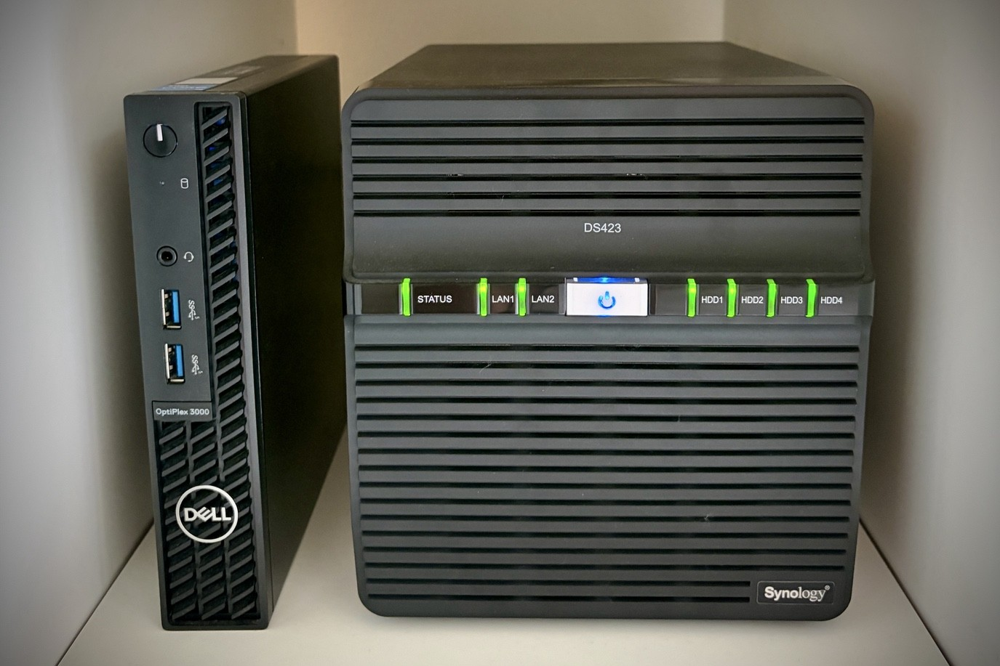

# Homelab — June 2026

## 🖥️ Physical Hosts

| Host | CPU | RAM | Storage | OS / Hypervisor | IP |
| :--- | :--- | :--- | :--- | :--- | :--- |
| **Dell Optiplex 3000** | i5-12500T | 64GB | 1TB NVMe, 512GB SSD | Proxmox VE 9.2.3 | `192.168.100.100` |
| **Synology DS423** | RTD1619B | 2GB | 2x 1TB SSD, 2x 500GB SSD | DSM 7.3.2 U3 | `192.168.100.61` |

### ✅ Proxmox VE
Proxmox VE running on a **GMKTEC NUCBOX G3 Plus** node — **Intel N150**, **32GB RAM**, **1TB NVMe SSD** (SN580). Pulse is currently monitoring a single node; cluster topology unchanged from the April snapshot (2-node N150Cluster with x03 as the Qdevice).

**Node status:** online, 62GB RAM total, ~58% used.

---

## 📦 Virtual Machines

All VMs run on **pve1**.

| VM | vmid | OS | IP | RAM | Role |
|---|---|---|---|---|---|
| `homeassistant` | 100 | Home Assistant OS 17.3 | 192.168.100.3 | 2GB | Smart-home hub |
| `hermes` | 101 | Ubuntu 26.04 LTS | 192.168.100.101 | 4GB | Hermes AI agent VM |
| `ds2` | 102 | DSM (virtualized) 4.4.302+ | 192.168.100.26 | 4GB | Virtual Synology |
| `w01-dhcp` | 104 | Windows Server 2022 | 192.168.100.66 | 4GB | AD / DHCP / DNS / NTP |
| `pbs` | 110 | Debian 13 (Trixie) | 192.168.100.4 | 4GB | Proxmox Backup Server |
| `docker-01` | 111 | Ubuntu 26.04 LTS | 192.168.100.102 | 8GB | Docker host (primary) |
| `docker-02` | 112 | Ubuntu 26.04 LTS | 192.168.100.103 | 8GB | Docker host (monitoring) |
| `pihole` | 159 | Ubuntu 26.04 LTS | 192.168.100.59 | 1GB | Pi-hole master DNS |
| `pihole2` | 169 | Ubuntu 26.04 LTS | 192.168.100.69 | 1GB | Pi-hole replica DNS |

### ✅ Home Assistant
Central IoT controller — climate (Samsung AC + dryer), environment sensors, and 3 Yeelight lamps (light bar, desk lamp, light strip). All integrations run locally over LAN. Web UI behind NPM at `ha.joeyme.eu`.

### ✅ Hermes
Hermes AI agent VM — Ubuntu 26.04 LTS, 4GB RAM. Runs the local tooling that powers this exact assistant. IP `192.168.100.101`, exposed externally as `hermes.joeyme.eu`.

### ✅ ds2 (virtual Synology)
A second Synology DSM instance, **virtualized** as a Proxmox VM (`vmid 102`, 4GB RAM) rather than running on bare metal. Lets me experiment with DSM features without touching the physical DS423+. IP `192.168.100.26`.

### ✅ w01-dhcp (Windows Server 2022)
Domain controller, DHCP server, authoritative DNS for `local.home`, and Stratum-2 NTP source (syncs from `time.google.com`). **DHCP scope:** `192.168.100.2–.253`, hands both Pi-holes (`.59`, `.69`) as DNS. No domain-joined clients yet — GPOs are in place for when they're needed.

### ✅ pbs
Proxmox Backup Server — see the **Backup** section below.

### ✅ docker-01
Primary Docker host — 8 containers, see **Docker Containers** section. Runs on Ubuntu 26.04, all containers on the `macvlan-net` network with static IPs on `192.168.100.0/24`.

### ✅ docker-02
Monitoring-focused Docker host — runs Pulse and Apprise. 4 containers, all on the `pulse_macvlan` network. Hosts the **alerting** chain for the whole stack.

### ✅ Pi-hole (master + replica)
Two instances in **active/active** mode — both VMs on pve1, both handed to DHCP clients as primary/secondary DNS. Synced one-way (pihole → pihole2) every hour via `nebula-sync` running on docker-01.

| Role | Hostname | IP | Sync direction |
|---|---|---|---|
| Master | `pihole.joeyme.eu` | 192.168.100.59 | source |
| Replica | `pihole2.joeyme.eu` | 192.168.100.69 | destination |

**Upstream DNS:** Quad9 (no-log, no-censorship) — `9.9.9.9`, `149.112.112.112`.

**Blocklists:** StevenBlack/hosts (ads, tracking, spam, gambling, adult), developer-dan ads-and-tracking-extended, hagezi dns-blocklists (multi), StevenBlack adult, matomo referrer-spam.

**Custom records:** 41 domains blocked, 15 whitelisted.

**Conditional forwarding:** `*.local.home` → AD DNS at `192.168.100.66#53`.

**Local DNS records** registered for the whole LAN — including all 9 VMs, the Synology, Samsung IoT appliances, the Android TV box, and the `*.joeyme.eu` wildcard pointing at NPM. (See `/mnt/second-brain/homelab/services/pihole.md` for the full table.)

---

## 🐳 LXC Containers

| LXC | vmid | IP | RAM | Role |
|---|---|---|---|---|
| `plex` | 109 | 192.168.100.20 | 2GB | Plex Media Server |

### ✅ Plex
Media server running as a lightweight Proxmox LXC (~2GB RAM, negligible CPU). Library: **86 movies, 5 TV shows, 116 albums**. Most media is on local LXC disk; some movies and TV mount through from the Synology via a Proxmox-host CIFS share, bind-mounted into the container. Web UI behind NPM at `plex.joeyme.eu`. Fully automated TV acquisition workflow — cron-driven download, Plex picks it up, daily library scan at ~02:00.

---

## 🐋 Docker Containers

14 containers across 3 hosts. All hosts are themselves Proxmox VMs (see above); the **Synology** row below is the third host and runs on bare-metal DS423+.

### docker-01 (192.168.100.102) — 8 containers

| Container | Image | What it does |
|---|---|---|
| `homepage` | `ghcr.io/gethomepage/homepage:latest` | Main homelab dashboard (macvlan, 192.168.100.23) |
| `npm` | `jc21/nginx-proxy-manager:latest` | Reverse proxy + Let's Encrypt DNS-01 (macvlan, 192.168.100.21) |
| `npm-tailscale` | `tailscale/tailscale:latest` | Tailscale sidecar in NPM's netns — remote access without exposing 80/443 |
| `unifi` | `lscr.io/linuxserver/unifi-network-application:latest` | UniFi Network Application (macvlan, 192.168.100.28) |
| `unifi-db` | `mongo:7.0` | MongoDB for UniFi (private network) |
| `nebula-sync` | `lovelaze/nebula-sync:latest` | One-way Pi-hole sync (master → replica, hourly) |
| `dozzle` | `amir20/dozzle:latest` | Real-time Docker log viewer, with auth |
| `watchtower` | `nickfedor/watchtower:latest` | Auto-updates container images daily at 03:00, with cleanup |

### docker-02 (192.168.100.103) — 4 containers

| Container | Image | What it does |
|---|---|---|
| `pulse` | `rcourtman/pulse:latest` | Infrastructure monitoring (macvlan, 192.168.100.11) — agents on pve1, ds1, docker-01, docker-02 |
| `apprise` | `caronc/apprise:latest` | Remote notification API (macvlan, 192.168.100.120) — Pulse pushes alerts here |
| `dozzle` | `amir20/dozzle:latest` | Same as docker-01's — local log viewer |
| `watchtower` | `nickfedor/watchtower:latest` | Auto-updates, same schedule |

### Synology DS423 (192.168.100.61) — 2 containers

| Container | Image | What it does |
|---|---|---|
| `uptime-kuma` | `louislam/uptime-kuma:2` | Out-of-band ICMP monitoring — independent of Pulse, alerts via its own Telegram channel |
| `pigallery2` | `bpatrik/pigallery2:latest` | Read-only photo gallery for archived family photos 2004–2018 (~36GB) |

---

## 💾 Backup

### ✅ Proxmox Backup Server
- **PBS version:** 4.2
- **Host VM:** `pbs` (vmid 110, pve1) — Debian 13 Trixie, 4GB RAM
- **Datastore:** `pbs-nas` — Synology NFS mount at `/mnt/pve/pbs-nas`
- **Datastore size:** 939 GB total / 405 GB used / 533 GB free (43% used)
- **Deduplication:** 12.6× (only changed blocks are stored)
- **Schedule:** daily at midnight
- **Coverage:** all VMs and LXCs on pve1
- **Connection health:** healthy

**Trialed and rejected:** Veeam VBR CE (May 20–21 2026) — 12GB+ RAM overhead, requires root SSH to PVE (conflicts with hardened config), no native LXC support. PBS is the only backup solution in the stack.

---

## 🗄️ Storage

### ✅ Synology DS423+ (physical NAS)
- **IP:** 192.168.100.61
- **OS:** DSM 7.3.2 (aarch64, 4 cores)
- **Uptime:** 8 days continuous
- **Total disk:** 707 GB used / 1.77 TB total (40%)

**Volumes (BTRFS):**

| Volume | Size | Used | Free | Use % | Role |
|---|---|---|---|---|---|
| `/volume1` | 884 GB | 323 GB | 560 GB | 37% | Primary data store (RAID 1) |
| `/volume2` | 874 GB | 382 GB | 491 GB | 44% | Media, downloads, ISO library, Time Machine (RAID 0) |

Also hosts the `pbs-nas` NFS share that PBS uses as its backup datastore, and runs the `uptime-kuma` + `pigallery2` Docker containers.

### ✅ Synology ds2 (virtual NAS)
- **IP:** 192.168.100.26
- **Host VM:** `ds2` (vmid 102, pve1) — 4GB RAM
- **OS:** Synology DSM (virtualized)

A second DSM instance, fully virtualized on Proxmox, for experimenting with DSM features without risking the physical NAS. New since April.

### ✅ Proxmox local storage (pve1)

| Storage | Type | Size | Used | Free | Use % | Content |
|---|---|---|---|---|---|---|
| `local` | dir | 100 GB | 41 GB | 60 GB | 41% | images, ISO, templates |
| `local-lvm` | lvm-thin | 852 GB | 448 GB | 404 GB | 53% | VM disks, container root dirs (SN580 NVMe) |
| `local-sata` | dir | 502 GB | 328 GB | 149 GB | 65% | backups, additional VM images (Samsung 850 PRO SATA SSD) |

The 850 PRO was added in May 2026 as an I/O-isolation play (separate backup target, not a performance fix — the SN580 is fast enough for normal use).

---

## 🔮 Future Plans

*Placeholder — to be filled in.*
