# Homelab — June 2026
> Snapshot of my self-hosted services running as of June 2026.
## 🖥️ Physical Hosts

| Host | Hostname |CPU | RAM | Storage | OS / Hypervisor | IP |
| :--- | :--- | :--- | :--- | :--- | :--- | :--- |
| **Dell Optiplex 3000** | pve1 | i5-12500T | 64 GB | 1 TB NVMe, 512 GB SSD | Proxmox VE 9.2.3 | `192.168.100.100` |
| **Synology DS423** | ds1 | RTD1619B | 2 GB | 2x 1 TB SSD, 2x 500 GB SSD | DSM 7.3.2 U3 | `192.168.100.61` |


### ✅ DELL Optiplex 3000 Micro

Small-form-factor desktop that runs the entire Proxmox stack.

| Spec | Detail |
| :--- | :--- |
| **CPU** | 12th gen Intel Core i5-12500T (Alder Lake, 6 cores / 12 threads) |
| **RAM** | 64 GB DDR4 |
| **Boot + VM disk** | 1 TB WD Blue SN580 NVMe M.2 — Proxmox host + `local-lvm` for all VM/container disks |
| **Backup disk** | 512 GB Samsung 850 PRO SATA SSD — second-site backup target |
| **Hypervisor** | Proxmox VE 9.2.3 |
| **IP** | `192.168.100.100` |

### ✅ Synology NAS DS423

The central storage hub is a **Synology DS423** running DSM 7.3.2 U3, populated entirely with 2.5" SSDs for silent, power-efficient operation.

| Storage Pool | Drives | Configuration | Primary Use Case | Free Space |
| :--- | :--- | :--- | :--- | :--- |
| **Storage Pool 1** | 2× 1 TB WD Red SA500 | RAID 1 (Btrfs) | Synology Photos, Note Station, Container Manager | 562.8 GiB |
| **Storage Pool 2** | 2× 500 GB Samsung 860 EVO | RAID 0 (Btrfs) | Proxmox Backup Server (PBS) Datastore only | 493.5 GiB |

> ℹ️ **Storage Architecture Notes:**
> * **Backup Strategy:** Storage Pool 1 is backed up to a virtual Arc-Xpenology instance (`ds2`) running on `PVE1` via Hyper Backup.
> * **RAID 0 Risk:** Storage Pool 2 runs in RAID 0 for maximum speed and capacity as a dedicated PBS backup target.

---

## 🎛️ Hypervisor

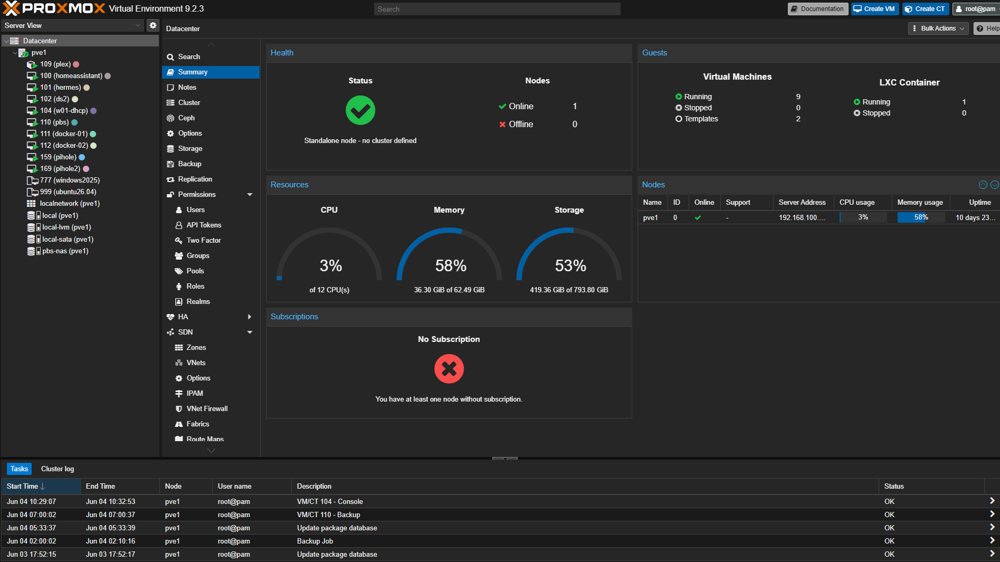

### ✅ Proxmox VE 9.2.3
Proxmox is my hypervisor of choice. Bare-metal KVM virtualization, lightweight LXCs, and a solid API make it a no-brainer for a homelab.
Plus, there is zero vendor lock-in and the open-source version is feature-complete.
Since April 2026, I downsized from a complex 3-node topology (2-node cluster + 1 standalone) to this single host.
I sacrificed High Availability (HA), but removing Corosync cluster overhead made the lab simpler, more efficient, and easier to troubleshoot.

| Spec | Detail |
| :--- | :--- |
| **Memory Usage** | ~58% of 64 GB utilized |
| **Disk Utilization (rootfs)** | 41 GB / 94 GB (44%) — `local` dir storage |
| **`local-lvm`** | LVM-thin pool on SN580 NVMe, 419 GB / 794 GB (53%) — VM disks, container root dirs |
| **`local-sata`** | dir on Samsung 850 PRO SATA SSD, 330 GB / 468 GB (70%) — second-site backup: hosts `ds2` (Hyper Backup target for physical ds1) + PBS VM vzdump |

## ⚙️ Proxmox Optimizations & Add-ons

### 🔋 CPU Power Management

To reduce power consumption and heat output on the Intel i5-12500T, the CPU frequency scaling governor is locked to `powersave`.

```bash
[root@pve1 ~]$ cat /sys/devices/system/cpu/cpu0/cpufreq/scaling_governor
powersave
```
The Intel i5-12500T CPU draws only around 8 W during normal operation.

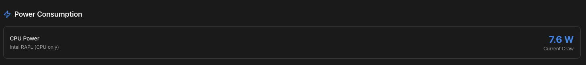

---

### 📊 ProxMenux Add-on

ProxMenux is configured via its interactive `menu` utility, providing an advanced terminal menu and web dashboard for Proxmox VE.

It offers:

- Provides an interactive terminal menu inside the Proxmox shell for quick administration tasks
- Node health monitoring and system vitals
- Hardware temperatures
- Active VM and container states and more

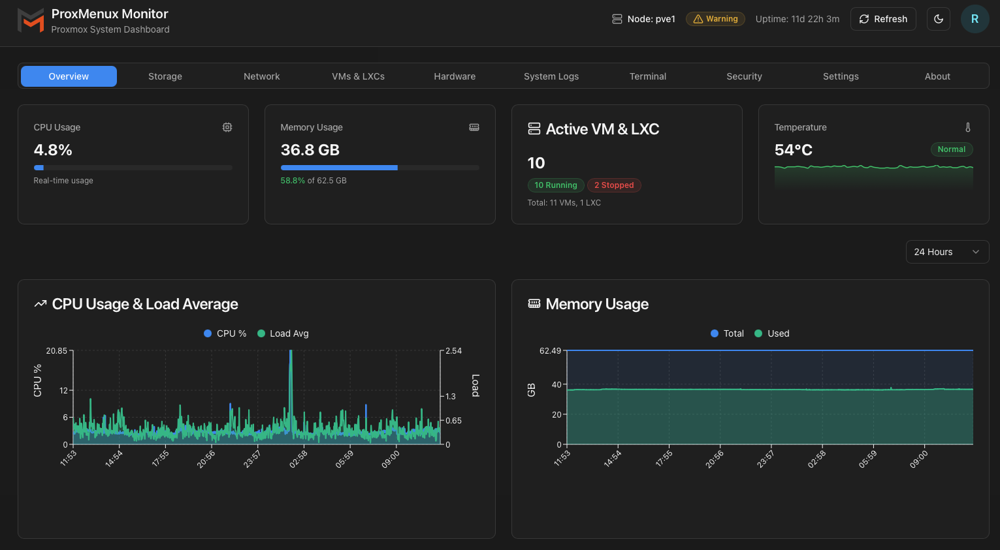

---

### 📈 Glances (Web Server Mode)

Glances is running locally on `pve1` in web server mode, providing a lightweight, terminal-style system overview.

Metrics are exposed directly into the main Homepage dashboard for real-time monitoring.

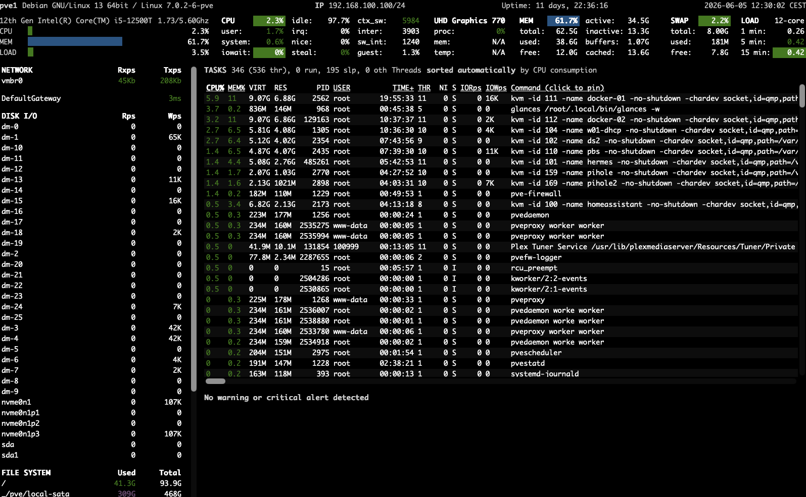

---

## 📦 Virtual Machines

| VM | hostname | vmid | OS | IP | RAM | Role |
| :---: | :--- | :--- | :--- | :--- | :--- | :--- |
|  | `homeassistant` | 100 | Home Assistant OS 17.3 | `192.168.100.3` | 2 GB | Smart-home hub |
|  | `hermes` | 101 | Ubuntu 26.04 LTS | `192.168.100.101` | 4 GB | Ansible Control Node<br>Hermes AI Agent VM |
|  | `ds2` | 102 | DSM 7.x (Xpenology) | `192.168.100.26` | 4 GB | Virtual Synology |
|  | `w01.local.home` | 104 | Windows Server 2022 | `192.168.100.66` | 4 GB | AD / DHCP / DNS / NTP |
|  | `pbs` | 110 | Debian 13 (Trixie) | `192.168.100.4` | 4 GB | Proxmox Backup Server |
|  | `docker-01` | 111 | Ubuntu 26.04 LTS | `192.168.100.102` | 8 GB | Docker host (primary) |
|  | `docker-02` | 112 | Ubuntu 26.04 LTS | `192.168.100.103` | 8 GB | Docker host (monitoring) |
|  | `pihole` | 159 | Ubuntu 26.04 LTS | `192.168.100.59` | 1 GB | Pi-hole master DNS |
|  | `pihole2` | 169 | Ubuntu 26.04 LTS | `192.168.100.69` | 1 GB | Pi-hole replica DNS |

### ✅ Home Assistant
Central IoT controller.

- **Devices:** Climate (Samsung AC + dryer), environment sensors, 3 Yeelight lamps (light bar, desk lamp, light strip)
- **Integrations:** All integrations run locally over LAN
- **Web UI:** Behind NPM at `ha.joeyme.eu`

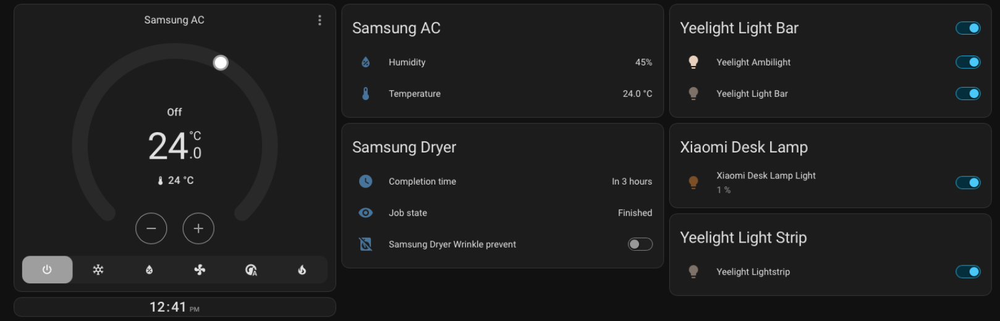

### ✅ Hermes
Hermes AI agent VM — Ubuntu 26.04 LTS, 4 GB RAM, IP `192.168.100.101`, exposed externally as `hermes.joeyme.eu`. Runs the local tooling for Hermes AI Agent.

- **Ansible control node:** All playbooks live in `~/ansible` and target the rest of the homelab from here (Picked up Ansible end of May 2026 as a step toward IaC).
- **Scheduled automations:** Daily **morning infrastructure & AI brief** (8:30 AM, pushed to Telegram), daily **TV procurement heartbeat** at noon, weekly **homelab infrastructure overview** regen (Mondays 7 AM), and a weekly **Pulse DB vacuum** (Sundays 5 AM). Most are script-only (no LLM in the loop) — keeps the dependency surface tight.

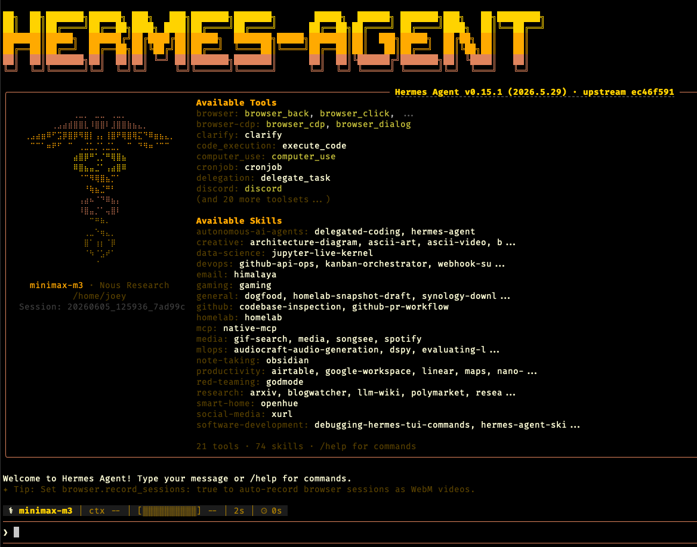

### ✅ ds2 (virtual Synology)
A second Synology DSM instance, **virtualized** as a Proxmox VM (`vmid 102`, 4 GB RAM) rather than running on bare metal. IP `192.168.100.26`.  
Exposed externally as ds2.joeyme.eu

- **Test DSM instance:** For trying out new features and packages
- **Hyper Backup vault target:** Most critical data from the primary physical DS423 replicates here

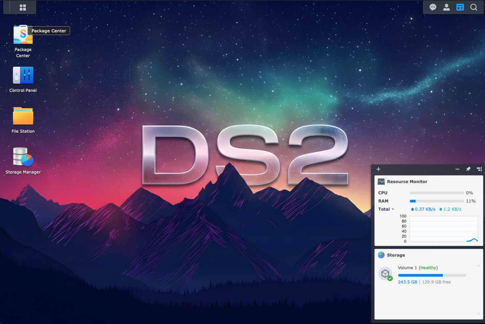

### ✅ w01.local.home (Windows Server 2022)
Domain controller, DHCP server, authoritative DNS for `local.home`, and Stratum-2 NTP source for my homelab (syncs from `time.google.com`).

- **DHCP scope:** `192.168.100.2–.253`, hands both Pi-holes (`.59`, `.69`) as DNS
- **AD domain:** Runs the `local.home` AD domain and GPOs for a handful of W11 PCs around the house

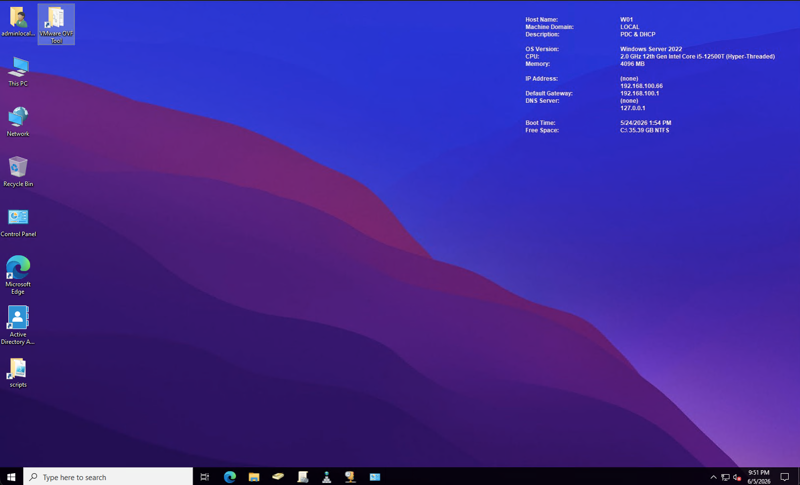

### ✅ pbs
Proxmox Backup Server — see the **Backup** section below.

### ✅ docker-01
Primary Docker host — 8 containers, see the **Docker Containers** section below.

### ✅ docker-02
Monitoring-focused Docker host — 4 containers, see the **Docker Containers** section below.

### ✅ Pi-hole (master + replica)
Two instances in **active/active** mode — both VMs on pve1, both handed to DHCP clients as primary/secondary DNS.
Synced one-way (pihole → pihole2) every hour via `nebula-sync` running on docker-01.

| Role | Hostname | IP | Sync direction |
|---|---|---|---|
| Master | `pihole.joeyme.eu` | `192.168.100.59` | source |
| Replica | `pihole2.joeyme.eu` | `192.168.100.69` | destination |

**Upstream DNS:** Quad9 (no-log, no-censorship) — `9.9.9.9`, `149.112.112.112`.

**Blocklists:** StevenBlack/hosts (ads, tracking, spam, gambling, adult), developer-dan ads-and-tracking-extended, hagezi dns-blocklists (multi), StevenBlack adult, matomo referrer-spam.

**Custom records:** 41 domains blocked, 15 whitelisted.

**Conditional forwarding:** `*.local.home` → AD DNS at `192.168.100.66#53`.

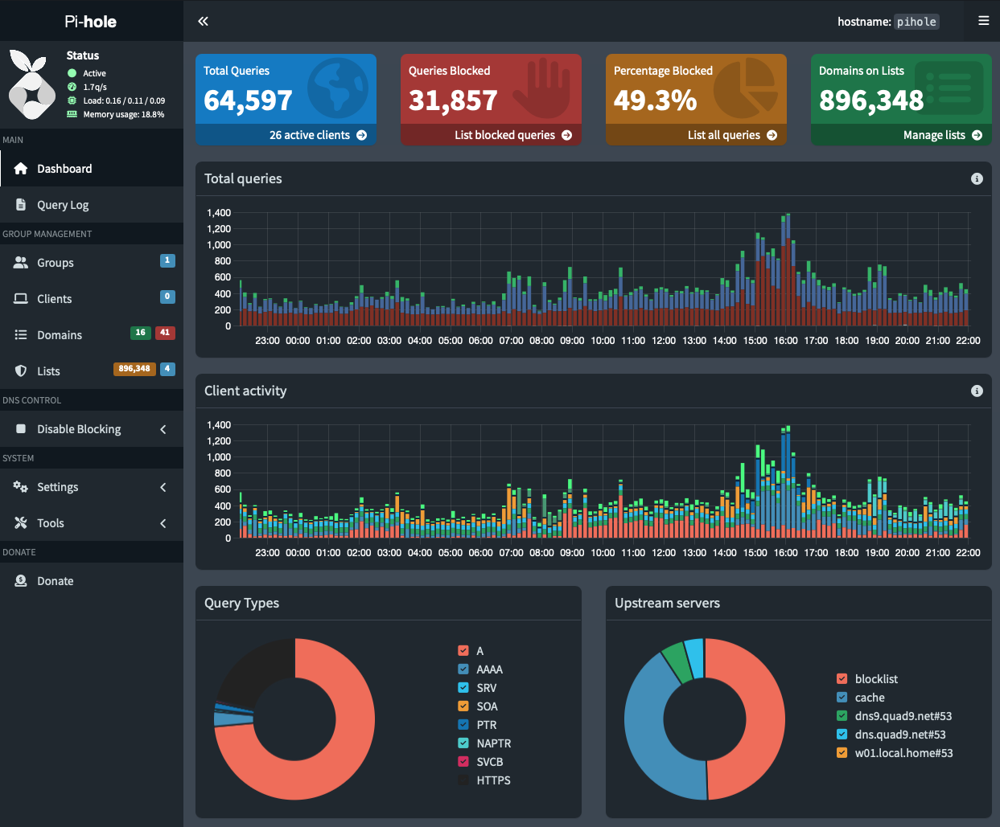

---

## 📋 VM Templates

Sysprepped / cloud-init-ready base images on PVE1, not currently running. Ready to clone-and-deploy when a new VM is needed.

### 📋 Windows Server 2025 Datacenter (vmid 777)

Sysprepped custom image of **Windows Server 2025 Datacenter** — waiting to be deployed in the future.

### 📋 Ubuntu 26.04 Cloud-Init (vmid 999)

Cloud-init ready template based on **Ubuntu 26.04 LTS**, using the native Proxmox Cloud-Init feature. At deployment time, the template:

- Configures the user automatically
- Sets DNS
- Sets IP
- Copies the public SSH key of my Mac
- Upgrades packages automatically

---

##  LXC Containers

| LXC | vmid | IP | RAM | Role |
|---|---|---|---|---|
| `plex` | 109 | `192.168.100.20` | 2 GB | Plex Media Server |

### ✅ Plex
Media server running as a lightweight Proxmox LXC.

- **Resources:** ~200 MB RAM, negligible CPU
- **Library:** **86 movies, 5 TV shows, 116 albums**
- **Storage:** Most media is on local LXC disk; some movies and TV mount through from the Synology via a Proxmox-host CIFS share, bind-mounted into the container
- **Web UI:** Behind NPM at `plex.joeyme.eu`
- **Automation:** Fully automated TV acquisition workflow — cron-driven download, Plex picks it up, daily library scan at ~02:00
- **PlexAmp:** Enables streaming on iOS from anywhere with better quality than traditional music streaming services — at zero cost and you own the media files
- **Why Plex, not Jellyfin:** Originally evaluated Jellyfin, but stuck with Plex due to native Samsung Smart TV app and no transcoding requirements

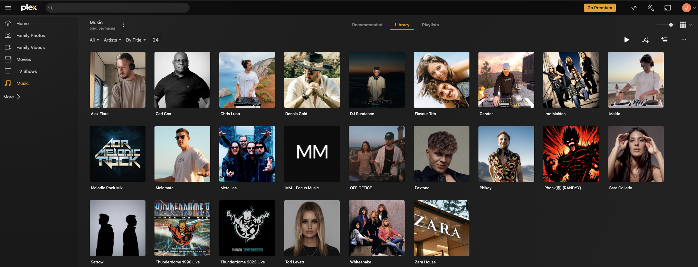

---

## 🐋 Docker Containers

14 containers across 3 hosts. All hosts are themselves Proxmox VMs (see above); the **Synology** row below is the third host and runs on bare-metal DS423.

### ✅ docker-01 (192.168.100.102) — 8 containers

| Container | Image | What it does |
|---|---|---|
| `homepage` | `ghcr.io/gethomepage/homepage:latest` | Main homelab dashboard (macvlan, 192.168.100.23) |
| `npm` | `jc21/nginx-proxy-manager:latest` | Reverse proxy + Let's Encrypt DNS-01 (macvlan, 192.168.100.21) |
| `npm-tailscale` | `tailscale/tailscale:latest` | Tailscale sidecar in NPM's netns — remote access without exposing 80/443 |
| `unifi` | `lscr.io/linuxserver/unifi-network-application:latest` | UniFi Network Application (macvlan, 192.168.100.28) |
| `unifi-db` | `mongo:7.0` | MongoDB for UniFi (private network) |
| `nebula-sync` | `lovelaze/nebula-sync:latest` | One-way Pi-hole sync (master → replica, hourly) |
| `dozzle` | `amir20/dozzle:latest` | Real-time Docker log viewer, with auth |
| `watchtower` | `nickfedor/watchtower:latest` | Auto-updates container images daily at 03:00, with cleanup |

---

**Homepage** - Main homelab dashboard

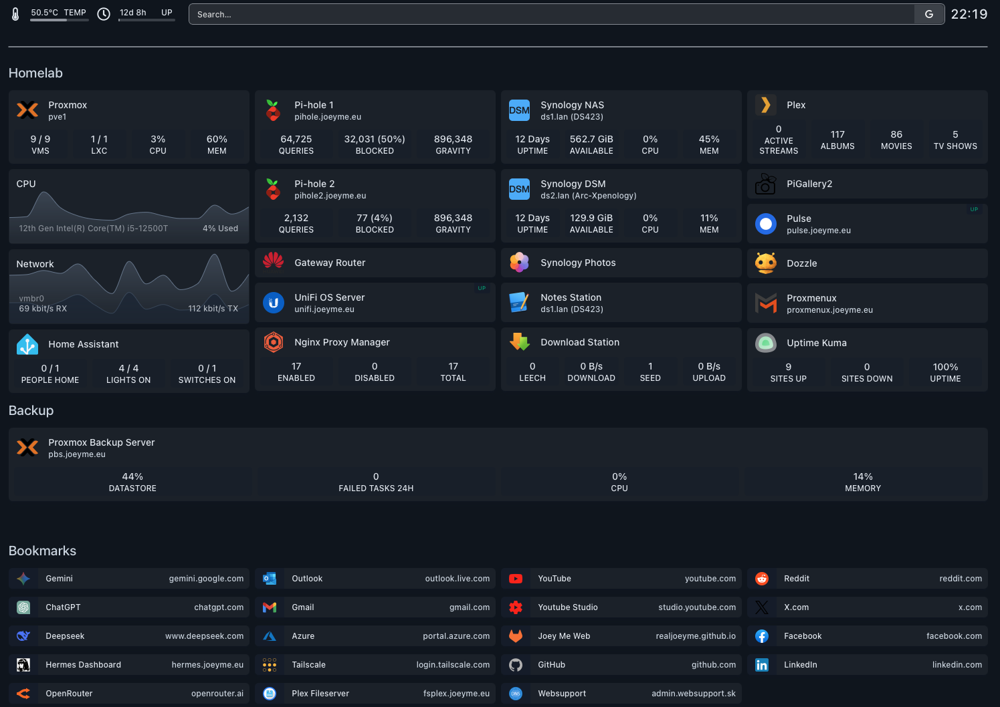

**NPM** - Reverse proxy + SSL

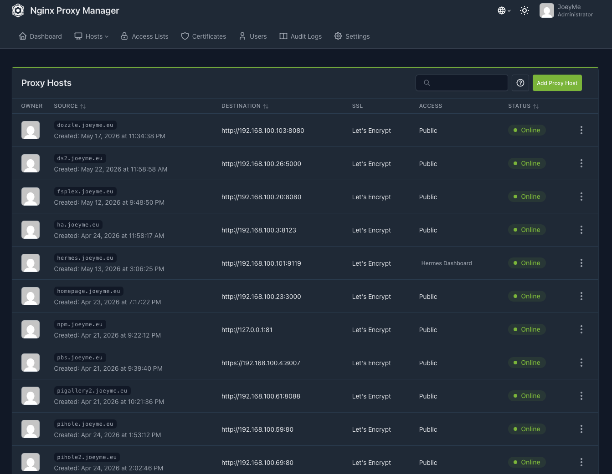

**Unifi** - UniFi Network Application

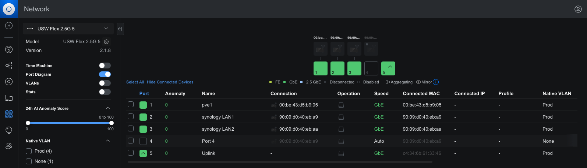

**Dozzle** - Docker log viewer

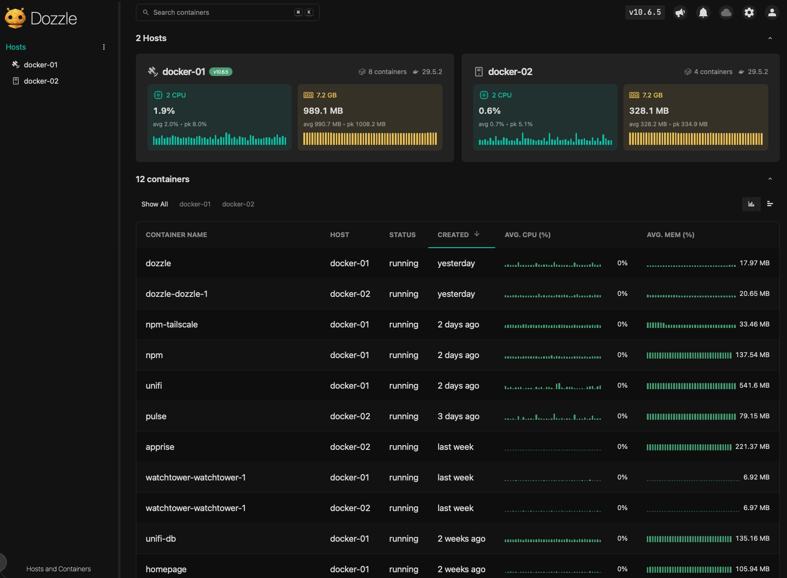

---

### ✅ docker-02 (192.168.100.103) — 4 containers

| Container | Image | What it does |
|---|---|---|
| `pulse` | `rcourtman/pulse:latest` | Infrastructure monitoring (macvlan, 192.168.100.11) — agents on pve1, ds1, docker-01, docker-02 |
| `apprise` | `caronc/apprise:latest` | Remote notification API (macvlan, 192.168.100.120) — Pulse pushes alerts here |
| `dozzle` | `amir20/dozzle:latest` | Same as docker-01's — local log viewer |
| `watchtower` | `nickfedor/watchtower:latest` | Auto-updates, same schedule |

---

**Pulse** - Main Infrastructure monitoring

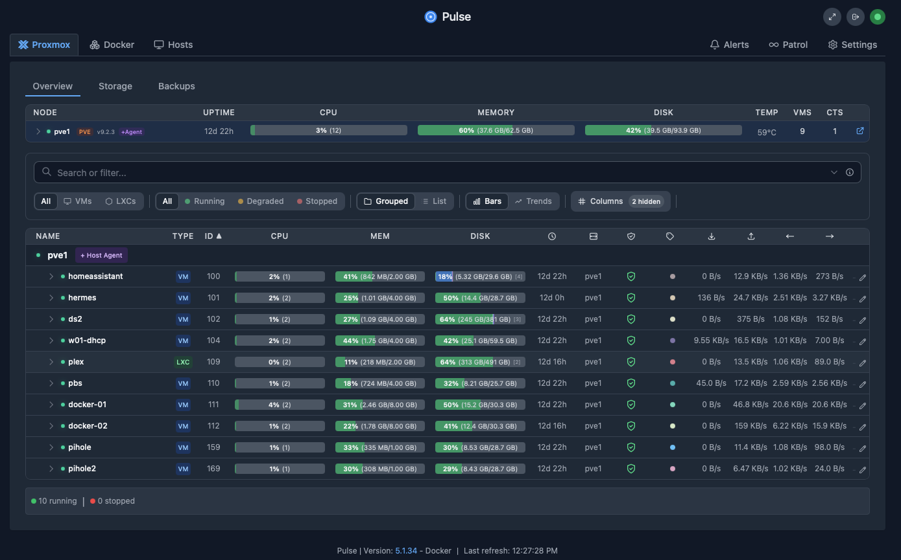

---

### ✅ Synology DS423 (192.168.100.61) — 2 containers

| Container | Image | What it does |
|---|---|---|
| `uptime-kuma` | `louislam/uptime-kuma:2` | Out-of-band ICMP monitoring — independent of Pulse, alerts via its own Telegram channel |
| `pigallery2` | `bpatrik/pigallery2:latest` | Read-only photo gallery for archived photos 2004–2018 (~36 GB) |

---

**Uptime-kuma** - Out-of-band ICMP monitoring

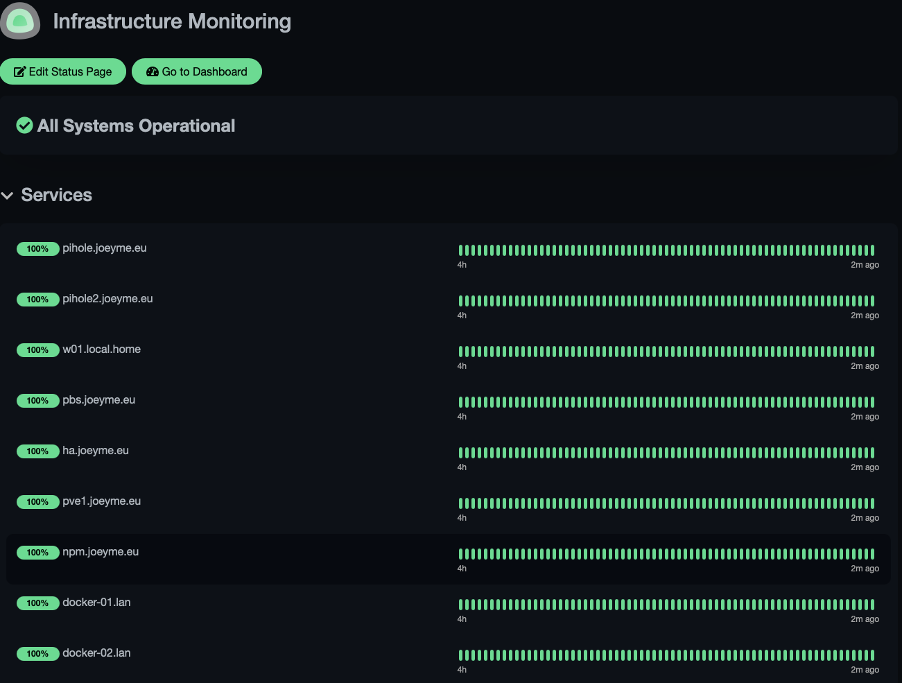

---

## 💾 Backup

### ✅ Proxmox Backup Server
- **PBS version:** 4.2
- **Host VM:** `pbs` (vmid 110, pve1) — Debian 13 Trixie, 4 GB RAM
- **Datastore:** `pbs-nas` — Synology NFS mount at `/mnt/pve/pbs-nas`
- **Datastore size:** 939 GB total / 405 GB used / 533 GB free (43% used)
- **Deduplication:** 12.6× (only changed blocks are stored)
- **Schedule:** daily at 2:00 AM
- **Coverage:** all VMs and LXCs on pve1
- **Connection health:** healthy

❗ **Trialed and rejected:** Veeam VBR CE (May 21 2026)
- 12 GB+ RAM overhead and needs a worker node VM
- Requires root SSH to PVE (conflicts with hardened config)
- No native LXC support

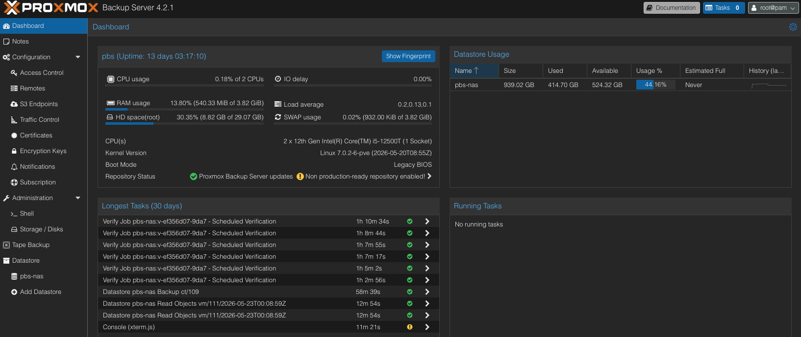

---

## 🔮 Future Plans

☑️ Expand Ansible Adoption - Continue moving manual configuration into Ansible playbooks  
☑️ Introduce Git-Based Configuration Management - Store infrastructure code in Git repositories  
☑️ Learn Terraform for VM Provisioning - Deploy Proxmox VMs through Terraform  
☑️ Explore Additional Linux Distributions - Build familiarity with alternative distributions  
☑️ Introduce Azure Infrastructure - Deploy a small Azure lab, Connect it to Tailscale  

